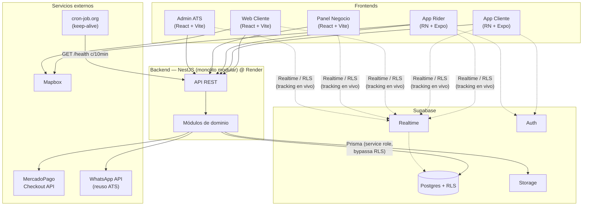
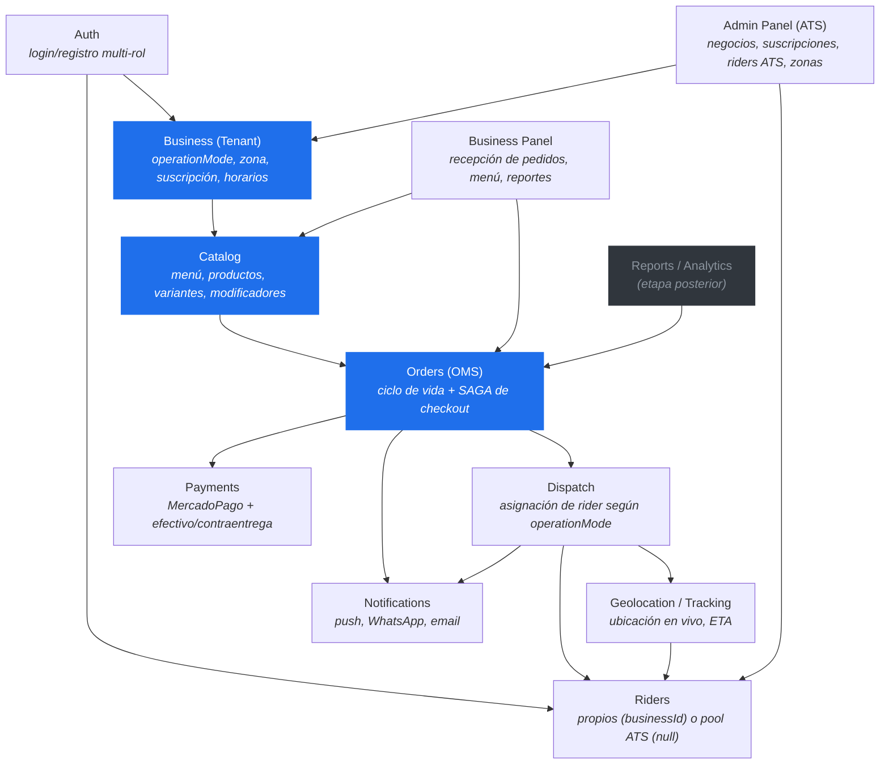
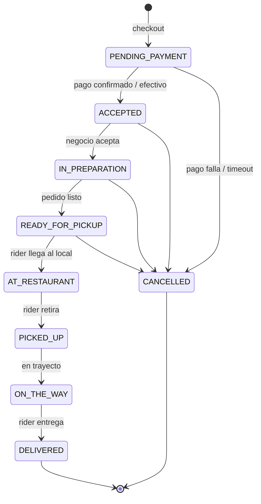
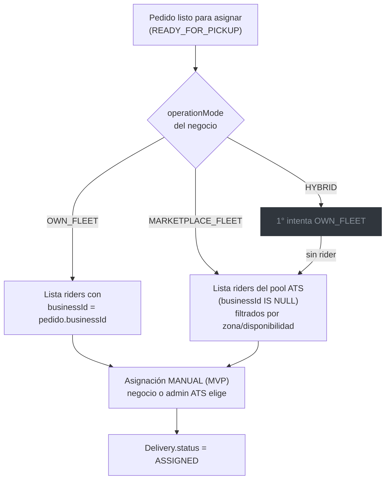
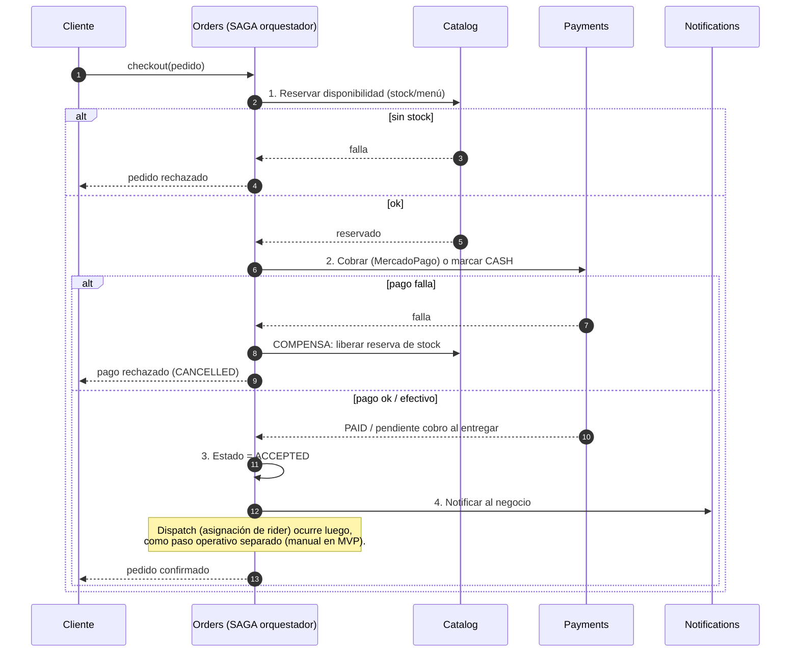
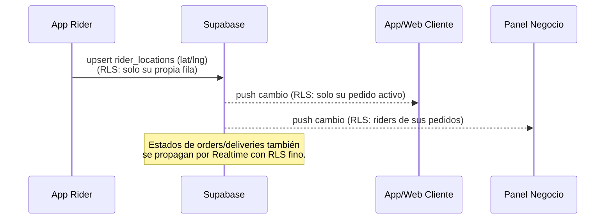

# Arquitectura — ATS-Express (Sistema de Delivery Híbrido)

> **Etapa 0 — Documento de arquitectura.**
> Monolito modular en NestJS, multi-tenancy "bridge model", Supabase (Postgres + RLS + Realtime).
> Autor del proyecto: Osmel — Aragon Tech Solutions (ATS), Maldonado, Uruguay.

---

## 1. Visión general

Un único backend NestJS (monolito modular) expone una sola API que consumen
**cuatro frontends**: web de pedido del cliente, app móvil del cliente, app del
rider, y los paneles web (negocio + admin ATS). La diferenciación entre negocios
con flota propia y el marketplace de ATS se hace **a nivel de datos**
(`operationMode` + `businessId`), no de infraestructura separada.



**Frontera de seguridad (multi-tenancy):**
- **Primaria:** NestJS. El backend se conecta con el **service role** de Supabase
  (bypassa RLS) y aísla por `businessId` mediante guards/policies de aplicación.
- **Defensa en profundidad:** RLS en Postgres (deny-all) + policies finas solo en
  las tablas que el front lee directo por Realtime (`orders`, `deliveries`,
  `rider_locations`). Ver `apps/api/prisma/rls/policies.sql`.

---

## 2. Módulos del monolito

Cada módulo vive en su propia carpeta con límites claros, para poder extraerlo a
un servicio independiente si el proyecto escala, sin reescribir la lógica.



| Módulo | Responsabilidad | MVP |
|---|---|---|
| **Auth** | Login/registro multi-rol (un rol por usuario) | Supabase Auth + tabla `Profile` |
| **Business** | Alta de negocios, `operationMode`, zona, suscripción, horarios | ✅ núcleo |
| **Catalog** | Menú: productos, categorías, variantes, modificadores, stock | ✅ |
| **Orders (OMS)** | Ciclo de vida del pedido, estados, SAGA de checkout | ✅ núcleo |
| **Dispatch** | Asignación de rider según `operationMode` | Manual en MVP |
| **Riders** | Riders propios o de ATS | ✅ |
| **Tracking** | Ubicación en vivo, ETA | Supabase Realtime |
| **Payments** | MercadoPago + efectivo/contraentrega | ✅ |
| **Notifications** | Push, WhatsApp, email | Etapa 4 |
| **Admin Panel (ATS)** | Negocios afiliados, suscripciones, riders ATS, zonas | Etapa 3 |
| **Business Panel** | Recepción de pedidos, menú, reportes | ✅ |
| **Reports** | Métricas de pedidos, ventas, performance | Etapa posterior |

---

## 3. Ciclo de vida del pedido



### Ramificación del Dispatch según `operationMode`



> En el MVP la asignación es **manual** (negocio para OWN_FLEET, admin ATS para
> MARKETPLACE_FLEET). `HYBRID` está previsto en el modelo de datos pero **no
> operativo**. La automatización por proximidad queda para etapa posterior.

---

## 4. SAGA de checkout (orquestada en Orders)

El checkout coordina varios pasos sin transacciones distribuidas. Cada paso tiene
su **acción de compensación** si un paso posterior falla.



**Compensaciones por paso:**

| Paso | Falla | Compensación |
|---|---|---|
| Reservar stock | sin disponibilidad | abortar, no se cobra |
| Cobrar | pago rechazado | liberar reserva de stock → `CANCELLED` |
| Asignar rider (post-checkout) | sin rider disponible | notificar al negocio, reintentar o cancelar |

> En el MVP (Etapa 1) el pago es **solo efectivo/contraentrega**, por lo que el
> paso 2 solo registra el método. MercadoPago se integra en Etapa 2 y ahí la SAGA
> ejerce la compensación de pago real.

---

## 5. Tracking en vivo (Supabase Realtime)



El tracking usa `rider_locations` (1 fila por rider, upsert desde la app). El
front se suscribe vía Supabase Realtime; las RLS finas garantizan que cada quien
solo ve lo que le corresponde, **mientras el delivery está activo**.

---

## 6. Stack y despliegue

| Capa | Tecnología | Despliegue |
|---|---|---|
| Backend | NestJS + Prisma v5 (monorepo `apps/api`) | **Render** |
| DB / Auth / Storage / Realtime | Supabase (Postgres + RLS) | Supabase |
| Web cliente + paneles | React + Vite + Tailwind (`apps/web`, `apps/admin`) | **Vercel** |
| Mobile cliente + rider | React Native + Expo → EAS Build (`apps/mobile`) | EAS / stores |
| Pagos | MercadoPago Checkout API | — |
| Mapas | Mapbox | — |
| Keep-alive | `GET /health` (sin tocar DB) golpeado por cron-job.org c/10 min | — |

**Estructura del monorepo (pnpm + Turborepo):**

```
ATS-Express/
├── apps/
│   ├── api/        # NestJS (monolito modular) + Prisma
│   │   └── prisma/
│   │       ├── schema.prisma
│   │       └── rls/policies.sql
│   ├── web/        # Web cliente (React + Vite)
│   ├── admin/      # Panel negocio + Admin ATS (React + Vite)
│   └── mobile/     # App cliente + rider (RN + Expo)
├── packages/
│   └── shared/     # tipos compartidos + cliente Prisma
└── docs/
    └── architecture.md
```

---

## 7. Etapas de desarrollo

| Etapa | Contenido | Estado |
|---|---|---|
| **0** | Schema Prisma + RLS + arquitectura | ✅ **completada** |
| 1 | MVP núcleo: Catalog + Orders + Business Panel + cliente básico, solo efectivo | ⏭️ siguiente |
| 2 | MercadoPago + Dispatch manual + Riders + estados completos + tracking | |
| 3 | Marketplace: Admin ATS + suscripciones + pool de riders | |
| 4 | Notificaciones (push/WhatsApp) + reportes + `/health` keep-alive | |
| 5 | Hardening: RLS, rate limiting, observabilidad, Dispatch automático, HYBRID real | |
